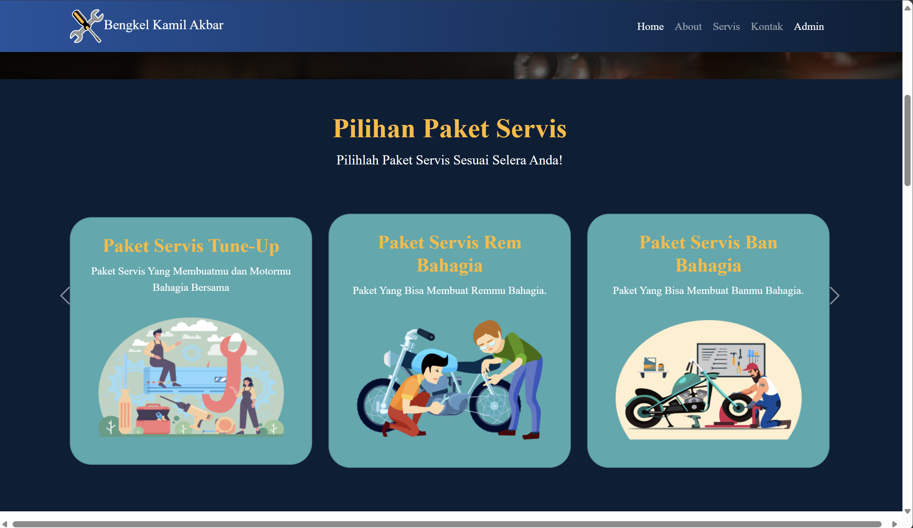
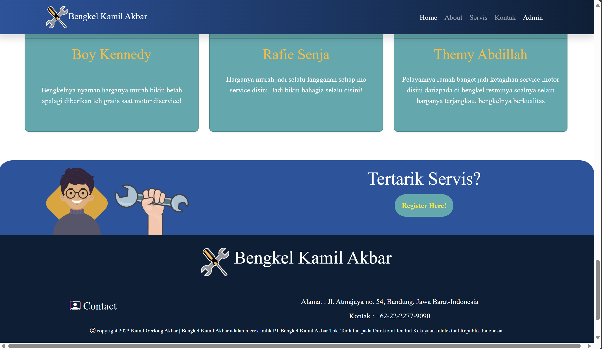
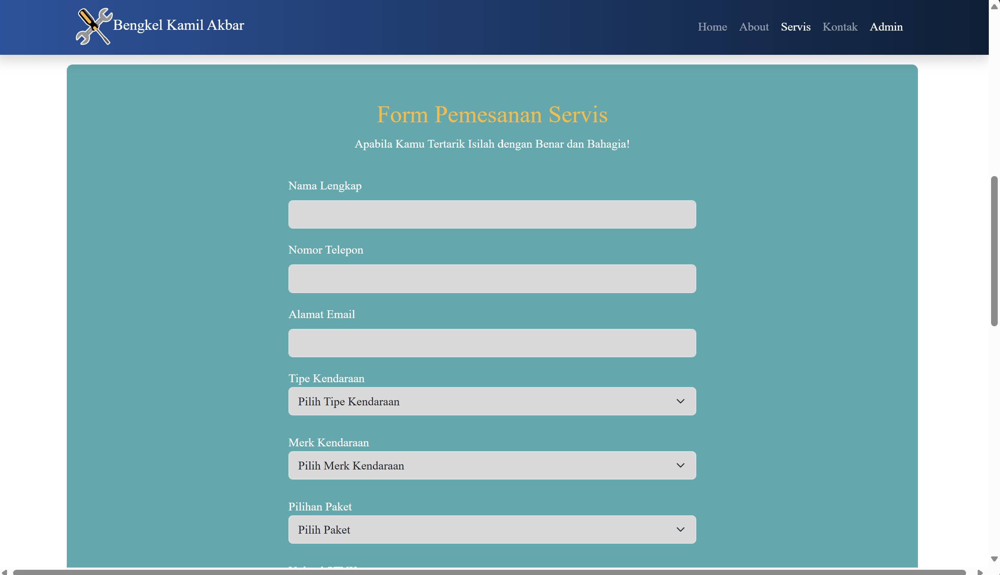
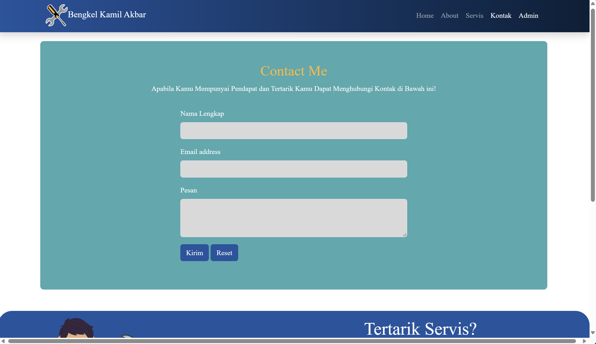

# Kamil Akbar
Sebuah aplikasi website untuk pendaftaran booking servis motor untuk calon pelanggan agar tidak perlu mengantri lagi sehingga pelanggan senang.


## Daftar Isi
- [Tumpukan Teknologi](#tumpukan-teknologi)
- [Fitur](#fitur)
- [Dokumentasi Halaman](#dokumentasi-halaman)
- [Cara Instalasi](#cara-instalasi)
- [Cara Penggunaan](#cara-penggunaan)

## Tumpukan Teknologi
### Frontend
- **Bootstrap 5**: Framework CSS yang digunakan untuk membuat desain web yang responsif dan modern dengan cepat

### Backend
- **Laravel 10**: Kerangka kerja PHP untuk pengembangan web yang elegan dan ekspresif

### DBMS
- **MySQL**: Sistem manajemen basis data relasional open-source

## Fitur
- **Login**: masuk ke halaman dengan otentikasi
- **Registrasi**: membuat akun sebelum masuk ke halaman utama
- **Lupa Password**: penggguna dapat mengganti password penggunannya apabila lupa dengan mengirimnya ke email pengguna
- **Kontak Pelanggan**: pelanggan dapat mengirim kritik maupun saran kepada bengkel
- **Daftar Harga Paket**: pelanggan dapat melihat daftar pakte yang tersedia di bengkel
- **Booking Servis**: pelanggan dapat memboking antrian servis agar tidak repot menunggu di bengkel


## Dokumentasi Halaman
##### 1. Halaman Dashboard Utama

##### 2. Halaman Paket

##### 3. Halaman Kaki

##### 4. Halaman Pemesanan Booking Servis

##### 5. Halaman Kontak Saran


## Cara Instalasi
```bash
# Clone repository ini
git clone https://github.com/defrijay/kamil-akbar.git

# Masuk ke direktori proyek
cd kamil-akbar

# Nyalakan apache dan mysql modulenya

# Import databasenya menggunakan phpmyadmin atau sejenisnya
db_bengkel.sql

# Jalankan server artisan
php artisan serve

# Buka url server artisannya
http://localhost:8000/

```

## Cara Penggunaan
1. Baca keseluruan tentang bengkelnya dan paketnya
2. Apabila ingin servis, maka isi formnya secara keseluruhan